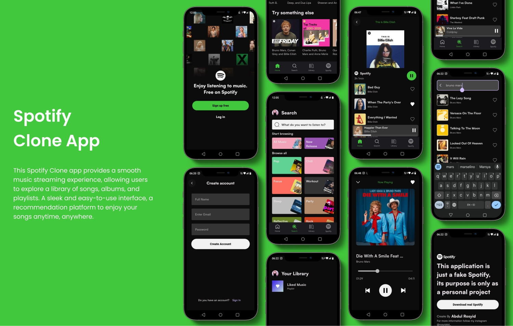

# 🎵 Spotify Clone - Fullstack Music Streaming App

A full-featured music streaming application built with **Flutter** and **Firebase**, implementing modern clean architecture principles and state management patterns.

---

## ✨ Features

- 🔐 **Authentication System**
  - Email/Password authentication via Firebase Auth
  - Secure user session management
  - Sign up, Sign in, and Sign out functionality

- 🎼 **Music Player**
  - Background audio playback with `just_audio` & `just_audio_background`
  - Play, pause, skip, and seek controls
  - Persistent playback state
  - Lock screen & notification controls

- 📚 **Music Library Management**
  - Browse songs by multiple criteria:
    - Release Date
    - Artist
    - Genres
    - Activity Type
  - Search functionality (by title and artist)
  - Personal music collection

- ❤️ **Favorites System**
  - Add/remove songs to favorites
  - Dedicated liked songs playlist
  - Real-time favorite status sync

- 🗂️ **Smart Organization**
  - Dynamic playlists based on filters
  - Artist-specific collections
  - Genre-based browsing
  - Activity-based recommendations

---

## 🎨 Result

### Overview Result


*Screenshots showcasing Home, Search, Library, and Profile screens*

---

## 🏗️ Architecture

This project follows **Clean Architecture** principles with clear separation of concerns:

```
lib/
├── core/                    # Core utilities and configs
├── data/
│   ├── models/             # Data models
│   ├── sources/            # Firebase services
│   └── repositories/       # Repository implementations
├── domain/
│   ├── entities/           # Business entities
│   ├── repositories/       # Repository interfaces
│   └── usecases/           # Business logic
├── presentation/
│   ├── bloc/               # BLoC state management
│   ├── pages/              # UI screens
│   └── widgets/            # Reusable widgets
└── service_locator.dart    # Dependency injection
```

### Key Architectural Patterns:
- **BLoC Pattern** for state management
- **Repository Pattern** for data abstraction
- **Use Cases** for business logic encapsulation
- **Dependency Injection** with GetIt
- **Clean routing** with GoRouter

---

## 🛠️ Tech Stack


| Technology | Purpose |
|------------|---------|
| **Flutter** | Cross-platform UI framework |
| **Firebase Auth** | User authentication |
| **Cloud Firestore** | NoSQL database for songs & user data |
| **Firebase Storage** | Media file storage |
| **BLoC** | State management |
| **GetIt** | Dependency injection |
| **GoRouter** | Declarative routing & navigation |
| **just_audio** | Audio playback engine |
| **just_audio_background** | Background playback support |
| **Dartz** | Functional programming (Either type) |
| **HydratedBloc** | State persistence |

---

## 📦 Project Structure

```
spotify_clone/
├── android/
├── ios/
├── lib/
│   ├── core/
│   │   ├── configs/
│   │   └── utils/
│   ├── data/
│   │   ├── models/
│   │   │   └── song/
│   │   ├── sources/
│   │   │   ├── auth/
│   │   │   └── song/
│   │   └── repositories/
│   ├── domain/
│   │   ├── entities/
│   │   ├── repositories/
│   │   └── usecases/
│   │       ├── auth/
│   │       └── song/
│   ├── presentation/
│   │   ├── bloc/
│   │   ├── pages/
│   │   │   ├── auth/
│   │   │   ├── home/
│   │   │   ├── search/
│   │   │   ├── library/
│   │   │   ├── profile/
│   │   │   └── song_playlist/
│   │   └── widgets/
│   ├── routes/
│   │   ├── routes.dart
│   │   └── routes_name.dart
│   ├── service_locator.dart
│   └── main.dart
├── assets/
│   └── overview/
├── .env
└── pubspec.yaml
```

---

## 🚀 Getting Started

### Prerequisites

- Flutter SDK (3.0 or higher)
- Dart SDK
- Firebase account
- Android Studio / VS Code
- iOS development tools (for iOS deployment)

### Installation

1. **Clone the repository**
   ```bash
   git clone https://github.com/rosyiddd666999/spotify-clone-fullstack.git
   cd spotify-clone-fullstack
   ```

2. **Install dependencies**
   ```bash
   flutter pub get
   ```

3. **Firebase Setup**
   
   - Create a new Firebase project at [Firebase Console](https://console.firebase.google.com)
   - Enable **Authentication** (Email/Password)
   - Create a **Firestore Database**
   - Set up **Firebase Storage**
   - Download and add configuration files:
     - `google-services.json` for Android (`android/app/`)
     - `GoogleService-Info.plist` for iOS (`ios/Runner/`)

4. **Configure FlutterFire**
   ```bash
   flutterfire configure
   ```

5. **Environment Variables**
   
   Create a `.env` file in the root directory:
   ```env
   # Add your environment variables here if needed
   ```

6. **Run the app**
   ```bash
   flutter run
   ```

---

## 🔥 Firebase Configuration

### Firestore Structure

```
Firestore Database
├── Users/
│   └── {userId}/
│       └── FavoritesSongs/
│           └── {favoriteId}
│               ├── songId: string
│               └── addedDate: timestamp
│
└── Songs/
    └── {songId}
        ├── title: string
        ├── artist: string
        ├── duration: string
        ├── releaseDate: timestamp
        ├── genres: array
        ├── activityType: array
        ├── songUrl: string
        └── coverUrl: string
```

### Security Rules Example

```javascript
rules_version = '2';
service cloud.firestore {
  match /databases/{database}/documents {
    match /Users/{userId} {
      allow read, write: if request.auth != null && request.auth.uid == userId;
      
      match /FavoritesSongs/{favoriteId} {
        allow read, write: if request.auth != null && request.auth.uid == userId;
      }
    }
    
    match /Songs/{songId} {
      allow read: if request.auth != null;
      allow write: if false; // Only admins should write
    }
  }
}
```

---

## 🎯 Key Features Implementation

### Clean Architecture Flow

```
UI Layer (Presentation)
    ↓
BLoC (State Management)
    ↓
Use Cases (Business Logic)
    ↓
Repository Interface (Domain)
    ↓
Repository Implementation (Data)
    ↓
Data Sources (Firebase)
```

### State Management with BLoC

The app uses BLoC pattern for predictable state management:
- Separation of UI and business logic
- Reactive programming with streams
- Easy testing and maintenance

### Routing with GoRouter

Clean, type-safe navigation with:
- Nested navigation for bottom navigation bar
- Deep linking support
- Redirect logic for authentication
- Named routes for maintainability

---

## 📱 Preview

### Main Features

| Home | Search | Library | Profile |
|------|--------|---------|---------|
|  |  |  |  |

*Note: Replace with actual screenshot paths*

---

## 🤝 Contributing

Contributions are welcome! Please feel free to submit a Pull Request.

1. Fork the project
2. Create your feature branch (`git checkout -b feature/AmazingFeature`)
3. Commit your changes (`git commit -m 'Add some AmazingFeature'`)
4. Push to the branch (`git push origin feature/AmazingFeature`)
5. Open a Pull Request

---

## 📝 License

This project is open source and available under the [MIT License](LICENSE).

---

## 👨‍💻 Developer

**Abdul Rosyid**
- Email: rosidabdul66@gmail.com
- GitHub: [@rosyiddd666999](https://github.com/rosyiddd666999)

---

## 🙏 Acknowledgments

- Flutter team for the amazing framework
- Firebase for backend infrastructure
- just_audio package contributors
- The open-source community

---

## 📞 Support

If you encounter any issues or have questions, please:
- Open an issue on GitHub
- Contact via email: rosidabdul66@gmail.com

---

## 🌟 Show Your Support

If you find this project helpful, please give it a ⭐ on GitHub!

---

&copy; 2024 Abdul Rosyid. All rights reserved.
